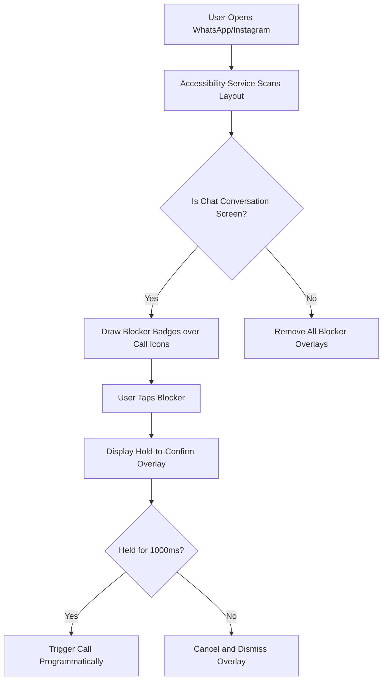

<p align="center">
  
</p>

<h1 align="center">Gentleman</h1>

<p align="center">
  
  
  
  
</p>

<p align="center">
  <b>Protecting your dignity, one tap at a time.</b>
</p>

---

## Why I Built Gentleman

This project exists because of one accidental tap.

Yes, it happened to me.

I accidentally started a video call with someone I absolutely did **not** intend to call. I hung up immediately and apologized.

The funny part? I'm an overthinker.

So instead of moving on, my brain immediately started asking:
> *"What do they think of me now?"*  
> *"Do they think I called on purpose?"*  
> *"Was that awkward?"*  

After a few minutes of unnecessary overthinking, I had a different thought:

**Why doesn't Android protect us from accidental taps in the first place?**

That single moment became the idea behind **Gentleman**.

So, to the person who accidentally received that call—**I'm genuinely sorry.** Your unexpected notification became an open-source project that might save thousands of people from experiencing the same awkward moment.

Sometimes the best projects don't start with a million-dollar idea.  
Sometimes they start with one unfortunate tap.

---

## What is Gentleman?

**Gentleman** prevents accidental voice and video calls in **WhatsApp** and **Instagram** by blocking standard tap actions on call buttons. It registers a secure Android Accessibility Service to track active screen layouts and overlay physical blockers. To initiate a call, the user must **hold down the blocker button to 100%** (1000ms), guaranteeing deliberate intent.

### Key Features
* 🛡️ **Zero Accidental Calls**: Overlays blocker buttons directly on top of call buttons inside chat conversations.
* ⏳ **Hold-to-Unlock**: Requires holding the lock icon for a configurable duration (default 1000ms) with visual progress feedback to initiate calls.
* 🚫 **Strict View Boundaries**: Overlays are restricted strictly to top header regions and active conversation windows. No blockers will appear in your chat list rows, bottom tabs, or call history screen.
* 🔒 **Privacy-First**: Operates completely offline. All application configurations are stored locally on-device. No trackers, no telemetry, and **no network permission requested**.
* 🎨 **Elegant Design**: Features dark-mode-first premium UI styling, system-wide overlays, and fluid progress animations.

---

## How It Works



---

## Build & Run

### Prerequisites
* Flutter SDK (3.0.0+)
* Android SDK (API Level 21+)
* Physical Android device or Emulator

### Getting Started
1. Fetch dependencies:
   ```bash
   flutter pub get
   ```
2. Enable developer options and USB debugging on your Android device.
3. Launch the application:
   ```bash
   flutter run
   ```
4. Grant the **Accessibility Service Permission** and **Overlay (Draw over other apps) Permission** via the app settings dashboard.

---

## Project Structure
```text
gentleman/
├── android/             # Android Kotlin backend (Accessibility Service & Overlay logic)
├── assets/              # App images and vector logo resources
├── lib/
│   ├── core/            # Theme, widgets, models, and platform channels
│   └── features/        # Shell page, Dashboard, settings, and statistics pages
└── test/                # Unit and widget test files
```

---

## Contributing

We welcome contributions of all types! Please read our [Contributing Guidelines](CONTRIBUTING.md) to understand our coding conventions, Git workflow, and how to inspect system accessibility node structures.

## License

This project is licensed under the MIT License — see the [LICENSE](LICENSE) file for details.
